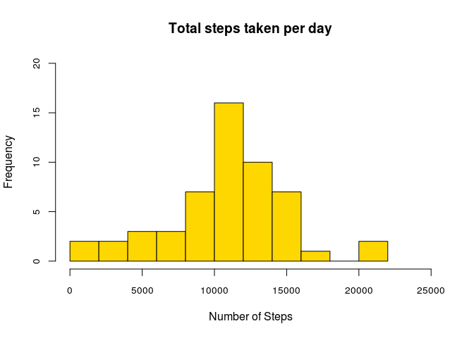
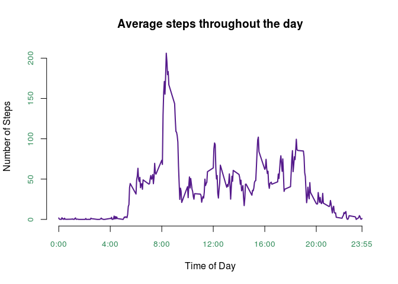
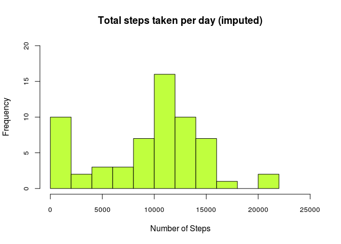
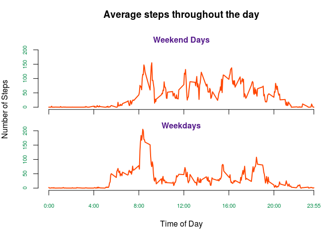

# Reproducible Research: Peer Assessment 1


## Loading and preprocessing the data

### Loading the data:

First, we set the working directory. To run this file on your own computer, you may need to change the working directory. You can do this using the "Session" menu in RStudio, or using the line of code below with the file pathway edited to match your own directory.

```r
setwd("~/RepData_PeerAssessment1")
```

R "unzips"" the compressed file in the working directory, and loads the CSV file:

```r
unzip("activity.zip", "activity.csv")
```

We read the CSV file into R:

```r
activity <- read.csv("activity.csv")
```

### Checking the data:

View the structure of the data:

```r
str(activity)
```

```
## 'data.frame':	17568 obs. of  3 variables:
##  $ steps   : int  NA NA NA NA NA NA NA NA NA NA ...
##  $ date    : Factor w/ 61 levels "2012-10-01","2012-10-02",..: 1 1 1 1 1 1 1 1 1 1 ...
##  $ interval: int  0 5 10 15 20 25 30 35 40 45 ...
```

We can see three columns (variables) representing the number of steps taken in a five-minute interval as an integer (steps), the date as a factor (date), and the hour and minute of the five-minute interval as an integer(interval). We will reformat the date and interval variables below.

First, though, we check for NAs in the dataset:

```r
sum(is.na(activity$steps))
```

```
## [1] 2304
```

```r
sum(is.na(activity$date))
```

```
## [1] 0
```

```r
sum(is.na(activity$interval))
```

```
## [1] 0
```

We see that only the steps column has missing data.

Note the issue that certain days include *only* NA values, for example the date 2012-10-1:

```r
nrow(activity[activity$date=="2012-10-01",])
```

```
## [1] 288
```

```r
sum(is.na(activity[activity$date=="2012-10-01",]))
```

```
## [1] 288
```

We will handle this issue by imputation later.

### Some formatting:

We'd like to format the date column as a "date" type, so that later we can ask R to identify the days of the week. R lets us simply reformat this:

```r
activity$date <- as.Date(activity$date, "%Y-%m-%d")
```

We'd also like to see the interval as a time of day instead of a number. To format the interval column as time, first we split the interval column into hours and minutes columns:

```r
interval <- unique(activity$interval)
hour <- vector(mode="character", length=length(interval))
minute <- vector(mode="character", length=length(interval))
for(i in 1:length(interval)) {
  for(h in 23:0) {
  if(interval[i] < h*100+100) {
    hour[i] <- as.character(h)
    minute[i] <- as.character(interval[i] - h*100)
  }
  }
}
```

Next, we join the new hours and minutes columns, adding a zero if minutes is less than 10:

```r
minute[minute=="0"] <- "00"
minute[minute=="5"] <- "05"
time <- paste(hour, minute, sep=":")
```

Finally, we merge the new time column (as factor) with the activity dataset:

```r
time.interval <- data.frame(interval, time)
activity <- merge(activity, time.interval)
```

Now we have a well-formatted dataset to work with, named "activity". The only remaining problem is the NA values. We can check the structure again to make sure the formats are good:


```r
str(activity)
```

```
## 'data.frame':	17568 obs. of  4 variables:
##  $ interval: int  0 0 0 0 0 0 0 0 0 0 ...
##  $ steps   : int  NA 0 0 0 0 0 0 0 0 0 ...
##  $ date    : Date, format: "2012-10-01" "2012-11-23" ...
##  $ time    : Factor w/ 288 levels "0:00","0:05",..: 1 1 1 1 1 1 1 1 1 1 ...
```

## What is mean total number of steps taken per day?

### 1. Make a histogram of the total number of steps taken each day.

Note: NA values are included so that days with only NA are not summed as zero.

```r
sum.daily <- tapply(activity$steps, activity$date, sum, na.rm=FALSE)
hist(sum.daily, main="Total steps taken per day", xlab="Number of Steps", 
     breaks=10, col="gold", ylim=c(0,20), xlim=c(0,25000), cex.axis=.85)
```

 

The histogram is divided by 10 breaks to give a more detailed view of the distribution. This yields 11 sections, each with a range of 1923 steps. We can see that the most common number of steps per day was 9615 to 11538 steps. Four days contained less than 3846 steps (the first two sections), and two days contained a maximum of 19230 to 21194 steps.

### 2. Calculate and report the mean and median total number of steps taken per day.

Note: NAs are now excluded, allowing us to take the mean of only non-NA records.

```r
mean(sum.daily, na.rm=TRUE)
```

```
## [1] 10766.19
```

```r
median(sum.daily, na.rm=TRUE)
```

```
## [1] 10765
```

The mean and median are remarkably close to each other. This suggests that the mean is not being skewed by extremely high or low values.

## What is the average daily activity pattern?

### 1. Make a time series plot.


```r
mean.byinterval <- tapply(activity$steps, activity$interval, mean, na.rm=TRUE)
plot(names(mean.byinterval), mean.byinterval, type="l", main="Average steps throughout the day",
     xlab="Time of Day", ylab="Number of Steps", axes=FALSE, lwd=2, col="purple4")
axis(2, cex.axis=.85, col.axis="seagreen")
hourly <- seq(1, by=48, length.out=6)
hourly[7] <- 288
axis(1, cex.axis=.85, at=names(mean.byinterval)[hourly], labels=time[hourly], col.axis="seagreen")
```

 

We see little activity averaged across days from midnight to around 5am, when the individual is presumably sleeping. The individual's activity begins between 5am to 8am, when they might be waking up for work. The peak of maximum activity occurs from 8-9am, possibly during a commute or a frequent morning exercise session. There is a range of moderate activity from 9am-7pm as the workday continues, then falling activity from 7pm to midnight during what is likely leisure time and sleep. 

Our interpretation of likely activities driving this pattern is based on the Readme file, which indicates that all data are drawn from a single individual, and from the typical pattern of an American (US) workday.

### 2. Which 5-minute interval, on average across all the days in the dataset, contains the maximum number of steps?

We have a matching vector of formatted times (time) equal in length to the set of means by intervals (mean.byinterval). Here we search the time entry that aligns with the mean.byinterval entry containing the maximum of average number of steps.


```r
time[mean.byinterval==max(mean.byinterval)]
```

```
## [1] "8:35"
```

This interval falls within the 8-9am peak activity period observed on our time series plot.

## Imputing missing values

### 1. Calculate and report the total number of missing values in the dataset.

```r
sum(is.na(activity$steps))
```

```
## [1] 2304
```

```r
sum(is.na(activity$date))
```

```
## [1] 0
```

```r
sum(is.na(activity$interval))
```

```
## [1] 0
```

As observed in data preprocessing, only the steps column contains NAs. Some zero values exist, but we do not identify these as missing values because we cannot separate true zeros from error zeros. There are likely to be many intervals when no steps were taken because the subject was sleeping or sitting still. We will impute only the NA values.

### 2. Devise a strategy for filling in all of the missing values in the dataset. 

We choose to impute missing values by filling them with the median number of steps for the 5-minute interval. This preserves the daily activity pattern and, for days with only NA's, estimates the total steps per day. Median rather than mean avoids skewing our imputed value if there are some days when specific intervals contained extreme values.

### 3. Create a new dataset that is equal to the original dataset but with the missing data filled in.

Save a new dataset so that we don't overwrite the old one:

```r
activity2 <- activity
```

Calculate the set of medians by interval:

```r
median.byinterval <- tapply(activity2$steps, activity2$interval, median, na.rm=TRUE)
```

Fill NAs by looping through the 288 intervals:

```r
for(i in 1:length(median.byinterval)) {
  j <- unique(activity2$interval)[i]
  activity2[activity2$interval==j & is.na(activity2$steps),2] <- median.byinterval[i]
}
```

Our new dataset with interval-median imputed values is called "activity2". We use this dataset for the rest of the analysis.

### 4a. Make a histogram of the total number of steps taken each day.

```r
sum.daily2 <- tapply(activity2$steps, activity2$date, sum)
hist(sum.daily2, main="Total steps taken per day (imputed)", xlab="Number of Steps", 
     breaks=10, col="olivedrab1", ylim=c(0,20), xlim=c(0,25000), cex.axis=.85)
```

 

The histogram is divided into the same sections or ranges as before. Now we see an increased number of days with low numbers of total steps (0 to 1923 steps). However, the mode remains at 9615 to 11538 steps as before.

### 4b. Mean and median total steps per day:

Mean and median after imputing:

```r
mean(sum.daily2)
```

```
## [1] 9503.869
```

```r
median(sum.daily2)
```

```
## [1] 10395
```

Mean and median before imputing:

```r
mean(sum.daily, na.rm=TRUE)
```

```
## [1] 10766.19
```

```r
median(sum.daily, na.rm=TRUE)
```

```
## [1] 10765
```

### 4c. Do these values differ after imputation? What is the impact of imputating missing data?

Yes, the mean and median total steps taken per day differ after imputation. After imputation, the mean has decreased by 1262 steps, and the median has decreased by 370 steps. The imputed values for steps are lower than the non-NA values in terms of the total steps. Total daily number of steps appears lower after imputation.

## Are there differences in activity patterns between weekdays and weekends?

### 1. Create a new factor variable in the dataset with two levels – “weekday” and “weekend”.

R's weekend() function can identify days of the week from past years, as long as they are in the "date" format. We already provided this format during preprocessing. The weekend() function yields Boolean values, which we use to combine the Saturdays and Sundays by summing to get our weekend days vector (weekend):

```r
weekend <- ("Saturday" == weekdays(activity$date)) + ("Sunday" == weekdays(activity$date))
```

We replace 1's with the character string "weekend" and 0's with the character string "weekday", then convert to a factor type:

```r
weekend[weekend==1] <- "weekend"
weekend[weekend=="0"] <- "weekday"
weekend <- as.factor(weekend)
```

Finally, we join the weekend vector to the activity2 dataframe. Its entries are still in the same order, so it remains aligned with the date column.

```r
activity2 <- data.frame(activity2, weekend)
str(activity2)
```

```
## 'data.frame':	17568 obs. of  5 variables:
##  $ interval: int  0 0 0 0 0 0 0 0 0 0 ...
##  $ steps   : int  0 0 0 0 0 0 0 0 0 0 ...
##  $ date    : Date, format: "2012-10-01" "2012-11-23" ...
##  $ time    : Factor w/ 288 levels "0:00","0:05",..: 1 1 1 1 1 1 1 1 1 1 ...
##  $ weekend : Factor w/ 2 levels "weekday","weekend": 1 1 2 1 2 1 2 1 1 2 ...
```

### 2. Make a panel plot containing a time series plot of weekday days and weekend days (y-axis).

First, we separate the weekend and weekday datasets by subsetting:

```r
act.weekend <- activity2[activity2$weekend=="weekend",]
act.weekday <- activity2[activity2$weekend=="weekday",]
```

Next, we calculate the average number of steps taken daily within each subset:

```r
mean.weekend <- tapply(act.weekend$steps, act.weekend$interval, mean)
mean.weekday <- tapply(act.weekday$steps, act.weekday$interval, mean)
```

Finally, we create the graphs in a panel-style setup to allow comparison:

```r
par(mfrow=c(2,1), xpd=NA, mar=c(0,0,2,0), oma=c(5,4,3,1), cex.axis=0.7)

plot(names(mean.weekend), mean.weekend, type="l", ylim=c(0,200),
     xlab=" ", ylab=" ", axes=FALSE, lwd=2, col="orangered")
title(main="Weekend Days", cex.main=1, line=0.5, col.main="purple4")
axis(2, col.axis="springgreen4")
hourly <- seq(1, by=48, length.out=6)
hourly[7] <- 288
axis(1, at=names(mean.weekend)[hourly], labels=time[hourly], col.axis="white")

plot(names(mean.weekday), mean.weekday, type="l", ylim=c(0,200),
     xlab=" ", ylab=" ", axes=FALSE, lwd=2, col="orangered")
title(main="Weekdays", cex.main=1, line=0, col.main="purple4")
axis(2, col.axis="springgreen4")
hourly <- seq(1, by=48, length.out=6)
hourly[7] <- 288
axis(1, at=names(mean.weekday)[hourly], labels=time[hourly], col.axis="springgreen4")

title(main="Average steps throughout the day", xlab="Time of Day", ylab="Number of Steps",
      outer=TRUE)
```

 

There does appear to be a difference between the pattern of daily activity on weekend days versus weekdays. The weekday pattern best matches the average pattern graphed before, with activity beginning around 5am, peaking at 8-9am, and falling to near zero from 8-10pm. The weekend pattern begins later around 6-8am, shows the same 8am peak (suggesting this is a daily exercise session, rather than a commute), and ends later around 10pm-midnight. The weekend pattern also shows activity more evenly distributed through the day, with a lower maximum but with average activity nearing the maximum at multiple times throughout the day instead of staying below half the maximum all day as seen on weekdays.
